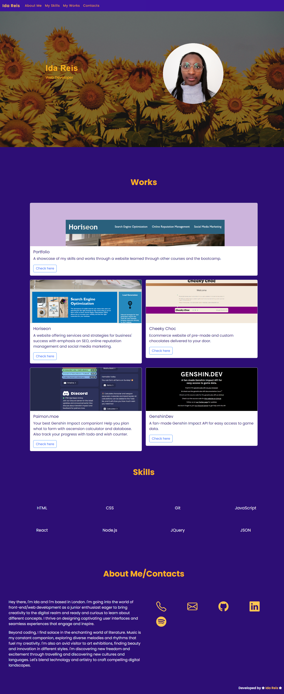
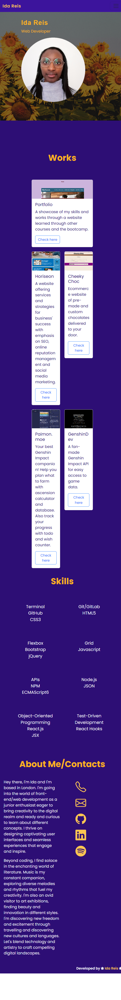

# ida-bootstrap-portfolio

## Description

A showcase of my skills and works through a website learned through other courses and the bootcamp built with bootstrap.

## Usage

Deployed URL: https://idareis.github.io/ida-bootstrap-portfolio/

- Each option in the navigation bar will take you to the section selected. The name has the same function as the Home section and will take you to the top of the page.
- Clicking on each image of the Work section will take you to the deployed website.
- The icons in the Contact Me section will take you to my respective profiles in each website (with the exception of the phone and email one which will take you to my gitHub)

- The website is also functional and responsive in smaller screen and devices.

## Credits

Photo by <a href="https://unsplash.com/@onkysf?utm_content=creditCopyText&utm_medium=referral&utm_source=unsplash">Yusuf Onuk</a> on <a href="https://unsplash.com/photos/a-group-of-sunflowers-pGpbccZU3vk?utm_content=creditCopyText&utm_medium=referral&utm_source=unsplash">Unsplash</a>.

Credits to <a href="https://github.com/Natalattef">Natalattef</a> for the collaboration for the Cheeky Choc website.

Credits to <a href="https://github.com/MadeBaruna">MadeBaruna</a> and <a href="https://github.com/NurMarvin">Marvin Witt</a> for images, descriptions and links provided for the open source APIs/applications.

  

## License

MIT.

Copyright (c) 2023 Ida Reis

Permission is hereby granted, free of charge, to any person obtaining a copy
of this software and associated documentation files (the "Software"), to deal
in the Software without restriction, including without limitation the rights
to use, copy, modify, merge, publish, distribute, sublicense, and/or sell
copies of the Software, and to permit persons to whom the Software is
furnished to do so, subject to the following conditions:

The above copyright notice and this permission notice shall be included in all
copies or substantial portions of the Software.

THE SOFTWARE IS PROVIDED "AS IS", WITHOUT WARRANTY OF ANY KIND, EXPRESS OR
IMPLIED, INCLUDING BUT NOT LIMITED TO THE WARRANTIES OF MERCHANTABILITY,
FITNESS FOR A PARTICULAR PURPOSE AND NONINFRINGEMENT. IN NO EVENT SHALL THE
AUTHORS OR COPYRIGHT HOLDERS BE LIABLE FOR ANY CLAIM, DAMAGES OR OTHER
LIABILITY, WHETHER IN AN ACTION OF CONTRACT, TORT OR OTHERWISE, ARISING FROM,
OUT OF OR IN CONNECTION WITH THE SOFTWARE OR THE USE OR OTHER DEALINGS IN THE
SOFTWARE.

## Badges

